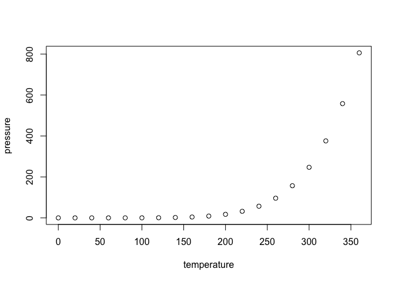

Test with Umlaute
================

-   [GitHub Documents](#github-documents)
-   [Including Code](#including-code)
-   [Including Plots](#including-plots)
-   [Datensätzen](#datensatzen)

GitHub Documents
----------------

This is an R Markdown format used for publishing markdown documents to GitHub. When you click the **Knit** button all R code chunks are run and a markdown file (.md) suitable for publishing to GitHub is generated.

Including Code
--------------

You can include R code in the document as follows:

``` r
summary(cars)
```

    ##      speed           dist       
    ##  Min.   : 4.0   Min.   :  2.00  
    ##  1st Qu.:12.0   1st Qu.: 26.00  
    ##  Median :15.0   Median : 36.00  
    ##  Mean   :15.4   Mean   : 42.98  
    ##  3rd Qu.:19.0   3rd Qu.: 56.00  
    ##  Max.   :25.0   Max.   :120.00

Including Plots
---------------

You can also embed plots, for example:



Note that the `echo = FALSE` parameter was added to the code chunk to prevent printing of the R code that generated the plot.

``` r
x <- "Datensätze"
cat(stringi::stri_escape_unicode(x))
```

    ## Datens\u00e4tze

Es gibt kein Problem innerhalb des Textes mit Datensätze. Wie ist es mit Links von [Datensätze](https://en.wikipedia.org/wiki/ISO_639-1) zu einer Website?

Datensätzen
-----------

Here comes new text.
