OpenIntro Statistics: Introduction to data
================
Peter Baumgartner
2017-02-05

-   [Data basics](#data-basics)
    -   [Get the data with base R as data frame](#get-the-data-with-base-r-as-data-frame)
    -   [Get the data with tidyverse as tibble](#get-the-data-with-tidyverse-as-tibble)
    -   [Explore the data](#explore-the-data)
    -   [Exercise 1](#exercise-1)
-   [Summaries and tables](#summaries-and-tables)
    -   [Summaries of numerical data with base R: `summary()`](#summaries-of-numerical-data-with-base-r-summary)
    -   [Summaries of numerical data with `dplyr`: `summarise()`](#summaries-of-numerical-data-with-dplyr-summarise)
    -   [Summaries of categorical data with base R: `table()`](#summaries-of-categorical-data-with-base-r-table)
    -   [Summaries of categorical data with `dplyr`: `count()`](#summaries-of-categorical-data-with-dplyr-count)
        -   [Question 1 \[closed\]: How to limit numbers after decimal point?](#question-1-closed-how-to-limit-numbers-after-decimal-point)
        -   [Question 2 \[open\]: German localisation for big numbers "." and decimal numbers ","](#question-2-open-german-localisation-for-big-numbers-.-and-decimal-numbers)
    -   [Graphical summary with base R: `barplot()`](#graphical-summary-with-base-r-barplot)
    -   [Graphical summary with `ggplot2`: `ggplot()`](#graphical-summary-with-ggplot2-ggplot)
    -   [Exercise 2](#exercise-2)
        -   [Question 3 \[open\]: Function to simulate `summary()`](#question-3-open-function-to-simulate-summary)
        -   [Question 4 \[closed\]: Subset just one figure of the contingengy table](#question-4-closed-subset-just-one-figure-of-the-contingengy-table)
        -   [Question 5 \[open\]: How to design more beautiful tables?](#question-5-open-how-to-design-more-beautiful-tables)
    -   [Exercise 3](#exercise-3)
    -   [Subsetting](#subsetting)
    -   [Exercise 4](#exercise-4)
-   [Quantitative data](#quantitative-data)
    -   [Conversion in metric system](#conversion-in-metric-system)
    -   [Boxplot](#boxplot)
    -   [`Table`command and mosaicplot](#tablecommand-and-mosaicplot)
        -   [Question 6 \[partly closed\]: `mosaicplot` in `ggplot`?](#question-6-partly-closed-mosaicplot-in-ggplot)
    -   [Body Mass Index (BMI)](#body-mass-index-bmi)
        -   [Question 7 \[closed\]: Why is conversation factor 703?](#question-7-closed-why-is-conversation-factor-703)
    -   [Exercise](#exercise)
    -   [Histograms](#histograms)
-   [On my own](#on-my-own)
    -   [Question 8 \[solved\]: How to enlarge the x-axis?](#question-8-solved-how-to-enlarge-the-x-axis)

Data basics
===========

Get the data with base R as data frame
--------------------------------------

The Behavioral Risk Factor Surveillance System (BRFSS) is an annual telephone survey of 350,000 people in the United States. The [BRFSS Web site](http://www.cdc.gov/brfss) contains a complete description of the survey, including the research questions that motivate the study and many interesting results derived from the data.

Load the data set from the [OpenIntro Website](http://www.openintro.org/stat/data/cdc.R). Have a look at the data in the browser to get a feeling of the interesting structure of the raw data.

Load the data set into R from the external website. But just once: As it is a big file (2.1 MB) it takes quite some time to load it into memory. Therefore save it as `.RData` file, which is later much faster to load. Later check if it is already loaded into memory:

``` r
> ## run the following lines just once 
> # source("http://www.openintro.org/stat/data/cdc.R")
> # dir.create("data")
> # save("cdc", file = "data/cdc.RData", compress = TRUE)
```

``` r
> if (!exists("cdc")) {load("data/cdc.RData")}
```

The data set `cdc` that shows up in your workspace is a data matrix, with each row representing a case and each column representing a variable. R calls this data format a data frame, which is a term that will be used throughout the labs.

Get the data with tidyverse as tibble
-------------------------------------

But I will convert all data frames into to a `tibbles`. This has some advantages, explained in [R for Data Science](http://r4ds.had.co.nz/tibbles.html)

-   It never changes an input’s type (i.e., no more stringsAsFactors = FALSE!).
-   It never adjusts the names of variables (i.e. you can create names with blanks)
-   It evaluates its arguments lazily and sequentially (i.e. you can calculate `y` from values of x during the creation)
-   It never uses `row.names()`. The whole point of tidy data is to store variables in a consistent way. So it never stores a variable as special attribute.
-   It only recycles vectors of length 1. This is because recycling vectors of greater lengths is a frequent source of bugs.
-   When you print a tibble, it only shows the first ten rows and all the columns that fit on one screen. It also prints an abbreviated description of the column type.
-   Tibbles are quite strict about subsetting. `[` always returns another tibble whereas d data frame sometimes returns a data frame and sometimes it just returns a vector.
-   Tibbles are also stricter with $. as they never do partial matching (a common source of error).
-   Tibbles ignore the drop argument.

Therefore I will call the matrix organisation of the data set "tibble" or abbreviated "tbl".

``` r
> library(tidyverse)
> CDC <- tbl_df(cdc)
> class(cdc)
```

    [1] "data.frame"

``` r
> class(CDC)
```

    [1] "tbl_df"     "tbl"        "data.frame"

"cdc" (with small letters) has class "data.frame", whereas "CDC" (with capital letters) now have "tbl\_df, tbl, data.frame" e.g. three classes at the same time to secure full compatiblity with data frames.

Explore the data
----------------

After loading the data and converting it into a tibble, one should inspect the data to get some understanding about the structure and content. Common funtions for these tasks are:

-   `<name-of-data-tibble>`: Display the first 10 rows and all columns that fit on one screen. It also prints an abbreviated description of the column type.
-   `head(<name-of-df>)`, `tail(<name-of-df>)`: Return the first or last part. Use these commands if it is not a tibble but a data frame
-   `dim()`: Retrieve the dimension
-   `names()`: Get the names
-   `str()`: Display compactly the internal structure
-   `glimpse()`: is the `dplyr`-version of `str()` showing values of each variable the whole sceen width, but does not display the number of levels and names of factor variables. But this feature of `str()` cannot be displayed completly with either many or long levels names.
-   `View()`: With [RStudio](https://www.rstudio.com/) you can see and inspect the data set comfortably. The `View()` function invokes a spreadsheet-style data viewer.

You can see and inspect the data set comfortably in RStudio with the `View()` command, which invokes a spreadsheet-style data viewer on a matrix-like R object.

``` r
> CDC
```

    # A tibble: 20,000 × 9
         genhlth exerany hlthplan smoke100 height weight wtdesire   age gender
    *     <fctr>   <dbl>    <dbl>    <dbl>  <dbl>  <int>    <int> <int> <fctr>
    1       good       0        1        0     70    175      175    77      m
    2       good       0        1        1     64    125      115    33      f
    3       good       1        1        1     60    105      105    49      f
    4       good       1        1        0     66    132      124    42      f
    5  very good       0        1        0     61    150      130    55      f
    6  very good       1        1        0     64    114      114    55      f
    7  very good       1        1        0     71    194      185    31      m
    8  very good       0        1        0     67    170      160    45      m
    9       good       0        1        1     65    150      130    27      f
    10      good       1        1        0     70    180      170    44      m
    # ... with 19,990 more rows

``` r
> head(CDC)
```

    # A tibble: 6 × 9
        genhlth exerany hlthplan smoke100 height weight wtdesire   age gender
         <fctr>   <dbl>    <dbl>    <dbl>  <dbl>  <int>    <int> <int> <fctr>
    1      good       0        1        0     70    175      175    77      m
    2      good       0        1        1     64    125      115    33      f
    3      good       1        1        1     60    105      105    49      f
    4      good       1        1        0     66    132      124    42      f
    5 very good       0        1        0     61    150      130    55      f
    6 very good       1        1        0     64    114      114    55      f

``` r
> tail(CDC)
```

    # A tibble: 6 × 9
        genhlth exerany hlthplan smoke100 height weight wtdesire   age gender
         <fctr>   <dbl>    <dbl>    <dbl>  <dbl>  <int>    <int> <int> <fctr>
    1      good       0        1        1     69    224      224    73      m
    2      good       1        1        0     66    215      140    23      f
    3 excellent       0        1        0     73    200      185    35      m
    4      poor       0        1        0     65    216      150    57      f
    5      good       1        1        0     67    165      165    81      f
    6      good       1        1        1     69    170      165    83      m

``` r
> dim(CDC)
```

    [1] 20000     9

``` r
> names(CDC)
```

    [1] "genhlth"  "exerany"  "hlthplan" "smoke100" "height"   "weight"  
    [7] "wtdesire" "age"      "gender"  

``` r
> str(CDC)
```

    Classes 'tbl_df', 'tbl' and 'data.frame':   20000 obs. of  9 variables:
     $ genhlth : Factor w/ 5 levels "excellent","very good",..: 3 3 3 3 2 2 2 2 3 3 ...
     $ exerany : num  0 0 1 1 0 1 1 0 0 1 ...
     $ hlthplan: num  1 1 1 1 1 1 1 1 1 1 ...
     $ smoke100: num  0 1 1 0 0 0 0 0 1 0 ...
     $ height  : num  70 64 60 66 61 64 71 67 65 70 ...
     $ weight  : int  175 125 105 132 150 114 194 170 150 180 ...
     $ wtdesire: int  175 115 105 124 130 114 185 160 130 170 ...
     $ age     : int  77 33 49 42 55 55 31 45 27 44 ...
     $ gender  : Factor w/ 2 levels "m","f": 1 2 2 2 2 2 1 1 2 1 ...

``` r
> glimpse(CDC)
```

    Observations: 20,000
    Variables: 9
    $ genhlth  <fctr> good, good, good, good, very good, very good, very g...
    $ exerany  <dbl> 0, 0, 1, 1, 0, 1, 1, 0, 0, 1, 1, 1, 1, 1, 1, 1, 0, 0,...
    $ hlthplan <dbl> 1, 1, 1, 1, 1, 1, 1, 1, 1, 1, 1, 1, 0, 1, 0, 1, 0, 1,...
    $ smoke100 <dbl> 0, 1, 1, 0, 0, 0, 0, 0, 1, 0, 1, 1, 1, 1, 0, 1, 1, 1,...
    $ height   <dbl> 70, 64, 60, 66, 61, 64, 71, 67, 65, 70, 69, 69, 66, 7...
    $ weight   <int> 175, 125, 105, 132, 150, 114, 194, 170, 150, 180, 186...
    $ wtdesire <int> 175, 115, 105, 124, 130, 114, 185, 160, 130, 170, 175...
    $ age      <int> 77, 33, 49, 42, 55, 55, 31, 45, 27, 44, 46, 62, 21, 6...
    $ gender   <fctr> m, f, f, f, f, f, m, m, f, m, m, m, m, m, m, m, m, m...

``` r
> # View(CDC)
```

The tibble has 2000 observations (= rows) with 9 variables (columns). Each one of these variables corresponds to a question that was asked in the survey:

1.  `genhlth`: respondents were asked to evaluate their general health, responding either excellent, very good, good, fair or poor.
2.  `exerany`: indicates whether the respondent exercised in the past month (1) or did not (0).
3.  `hlthplan`: indicates whether the respondent had some form of health coverage (1) or did not (0).
4.  `smoke100`: indicates whether the respondent had smoked at least 100 cigarettes in her lifetime.
5.  `height`: in inches
6.  `weight`: in pounds
7.  `wtdesire`: desired weight
8.  `age` in years
9.  `gender`: "m" or "f"

Exercise 1
----------

How many cases are there in this data set? How many variables? For each variable, identify its data type (e.g. categorical, discrete).

**My Solution**:

1.  There are 20000 cases (= observations) and 9 variables in the CDC data set.

2.  `genhlth`: excellent, very good, good, fair or poor = categorial
3.  `exerany`: past month (1) or not (0) = categorial
4.  `hlthplan`: some form of health coverage (1) or not (0) = categorial
5.  `smoke100`: had smoked at least 100 cigarettes in her lifetime = categorial
6.  `height`: in inches = continous
7.  `weight`: in pounds = continous
8.  `wtdesire`: desired weight = continuos
9.  `age` in years = discrete
10. `gender`: "m" or "f" = categorial

Summaries and tables
====================

Summaries of numerical data with base R: `summary()`
----------------------------------------------------

A good first step in any analysis is to distill all of that information into a few summary statistics and graphics. As a simple example, the function summary returns a numerical summary: minimum, first quartile, median, mean, second quartile, and maximum. For weight this is:

``` r
> summary(CDC$weight)
```

       Min. 1st Qu.  Median    Mean 3rd Qu.    Max. 
       68.0   140.0   165.0   169.7   190.0   500.0 

Summaries of numerical data with `dplyr`: `summarise()`
-------------------------------------------------------

`dplyr` does not have its own special methods for R summary function (see last sentence of vignette [Introduction to dplyr](https://cran.rstudio.com/web/packages/dplyr/vignettes/introduction.html). But you can use the R base functions with `dplyr` and some other extra functions supplied by `dplyr`. Besides functions in base R like `min()`, `max()`, `mean()`, `sum()`, `sd()`, `median()`, and `IQR()`. dplyr provides a handful of others:

-   `n()`: the number of observations in the current group
-   `n_distinct(x)`:the number of unique values in x.
-   `first(x)`, `last(x)` and \`nth(x, n) - these work similarly to x\[1\], x\[length(x)\], and x\[n\] but give you more control over the result if the value is missing.

``` r
> summarise(CDC, Min. = min(weight), "1st Qu." = quantile(weight, probs = 0.25), Median = median(weight), Mean = mean(weight), "3rd Qu." = quantile(weight, probs = 0.75), Max = max(weight))
```

    # A tibble: 1 × 6
       Min. `1st Qu.` Median    Mean `3rd Qu.`   Max
      <int>     <dbl>  <dbl>   <dbl>     <dbl> <int>
    1    68       140    165 169.683       190   500

The `dplyr`-equivalent of base R `summary()` is more complex, but has more control about functions used, their names in the table, their sequence etc. So we could add for instance `sd()`, `var()`, `IQR()`. To get these extra values with the base R functions one would have to be write different lines of code.

``` r
> summarise(CDC, Min. = min(weight), 
+           "1st Qu." = quantile(weight, probs = 0.25), 
+           Median = median(weight), Mean = mean(weight), 
+           "3rd Qu." = quantile(weight, probs = 0.75), 
+           Max = max(weight), Var = var(weight), 
+           SD = sd(weight), 
+           IQR = IQR(weight)
+           )
```

    # A tibble: 1 × 9
       Min. `1st Qu.` Median    Mean `3rd Qu.`   Max      Var       SD   IQR
      <int>     <dbl>  <dbl>   <dbl>     <dbl> <int>    <dbl>    <dbl> <dbl>
    1    68       140    165 169.683       190   500 1606.484 40.08097    50

But the great advantage for `summarise()` lies int the combination with the `group_by()` function of `dplyr` (see the examples in the [Introduction to dplyr](https://cran.rstudio.com/web/packages/dplyr/vignettes/introduction.html) vignette.)

Summaries of categorical data with base R: `table()`
----------------------------------------------------

While it makes sense to describe a quantitative variable like `weight` in terms of these statistics, what about categorical data? We would instead consider the sample frequency or relative frequency distribution. The function table does this for you by counting the number of times each kind of response was given. For example, to see the number of people who have smoked 100 cigarettes in their lifetime or instead look at the relative frequency distribution.

``` r
> table(CDC$smoke100)
```


        0     1 
    10559  9441 

``` r
> table(CDC$smoke100) / 20000
```


          0       1 
    0.52795 0.47205 

Notice how R automatically divides all entries in the table by 20,000 in the command above. This is similar to something we observed in the Introduction to R; when we multiplied or divided a vector with a number, R applied that action across entries in the vectors. As we see above, this also works for tables.

Summaries of categorical data with `dplyr`: `count()`
-----------------------------------------------------

But the outcome of the `table()` command is class "table" which is not so easy to work with as a data frame or a tibble. (See the article on [R-bloggers](https://www.r-bloggers.com/how-to-get-the-frequency-table-of-a-categorical-variable-as-a-data-frame-in-r/).) It is better to use the `count()` function of `dplyr`, because it adds the column names and returns – as all dply-functions — a tibble. Furthermore the relative frequency distribution (the propoartion) can be added as a new column in one command.

``` r
> CDC %>% 
+         count(smoke100) %>%
+         mutate(prop = round(n / nrow(CDC), digits = 2))
```

    # A tibble: 2 × 3
      smoke100     n  prop
         <dbl> <int> <dbl>
    1        0 10559  0.53
    2        1  9441  0.47

### Question 1 \[closed\]: How to limit numbers after decimal point?

How to limit the figure of `prop` to an accuracy of two digits after the decimal point? Use `round`as in the example above.

### Question 2 \[open\]: German localisation for big numbers "." and decimal numbers ","

How to use "." for big figures and "," for figurs after decimal point (comma) = German localisation for figures?

Graphical summary with base R: `barplot()`
------------------------------------------

Next, we make a bar plot of the entries in the table by putting the table inside the `barplot()` command.

``` r
> barplot(table(CDC$smoke100))
```

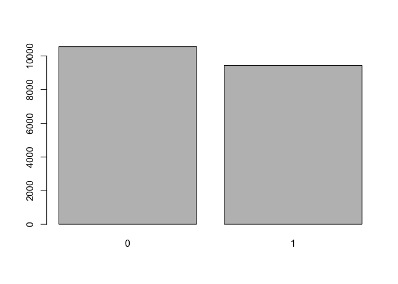 Notice what we’ve done here! We’ve computed the table of cdc$smoke100 and then immediately applied the graphical function, barplot. This is an important idea: R commands can be nested. You could also break this into two steps by typing the following:

``` r
> smoke <- table(CDC$smoke100)
> barplot(smoke)
```


Here, we’ve made a new object, a table, called `smoke` (the contents of which we can see by typing `smoke` into the console) and then used it in as the input for barplot. The special symbol `<-` performs an assignment, taking the output of one line of code and saving it into an object in your workspace.

Graphical summary with `ggplot2`: `ggplot()`
--------------------------------------------

A basic bar chart is drawn with `geom_bar()`. The following chart displays the total number of poeple in the CDC dataset, grouped by `smoke100`.The chart shows that slightly more people of the sample haven\`t even smoked 100 ciragettes during their lifetime.

``` r
> ggplot(data = CDC) + 
+   geom_bar(mapping = aes(x = smoke100))
```

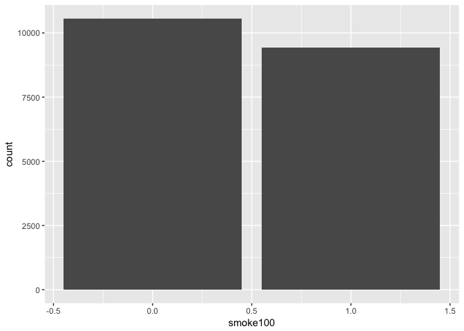 On the x-axis, the chart displays `smoke100`, a variable from `CDC`. On the y-axis, it displays count, but count is not a variable in `CDC`! Where does count come from? Many graphs, like scatterplots, plot the raw values of your dataset. Other graphs, like bar charts, calculate new values to plot:

-   bar charts, histograms, and frequency polygons bin your data and then plot bin counts, the number of points that fall in each bin.
-   smoothers fit a model to your data and then plot predictions from the model.
-   boxplots compute a robust summary of the distribution and then display a specially formatted box.

The algorithm used to calculate new values for a graph is called a `stat`, short for statistical transformation. You can learn which `stat a`geom`uses by inspecting the default value for the`stat`argument. For example,`?geom\_bar`shows the default value for`stat`is “count”, which means that`geom\_bar()`uses`stat\_count()`.`stat\_count()`is documented on the same page as`geom\_bar()`, and if you scroll down you can find a section called “Computed variables”. That tells that it computes two new variables:`count`and`prop\`.

ou can generally use `geoms` and `stats` interchangeably. For example, you can recreate the previous plot using `stat_count()` instead of `geom_bar()`:

``` r
> ggplot(data = CDC) + 
+   stat_count(mapping = aes(x = smoke100))
```

 This works because every `geom` has a default `stat`; and every `stat` has a default `geom`. This means that you can typically use geoms without worrying about the underlying statistical transformation. Sometimes you might need to use a stat explicitly: For instance when you want to override the default mapping from transformed variables to aesthetics. For example, you might want to display a bar chart of proportion, rather than count:

``` r
> ggplot(data = CDC) + 
+         stat_count(mapping = aes(x = smoke100, y = ..prop..), 
+                    fill = 'lightblue', color = 'black')
```

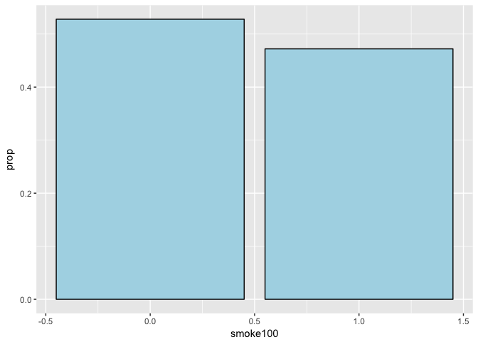

Exercise 2
----------

-   Create a numerical summary for `height` and `age`, and compute the interquartile range for each.
-   Compute the relative frequency distribution for `gender` and `exerany`.
-   How many males are in the sample?
-   What proportion of the sample reports being in excellent health?

**My Solution**:

    Using base R: height

       Min. 1st Qu.  Median    Mean 3rd Qu.    Max. 
      48.00   64.00   67.00   67.18   70.00   93.00 

                   IQR for height: 6 

    Using base R: age

       Min. 1st Qu.  Median    Mean 3rd Qu.    Max. 
      18.00   31.00   43.00   45.07   57.00   99.00 

                   IQR for age: 26 


        m     f 
     9569 10431 


          m       f 
    0.47845 0.52155 


         0      1 
    0.2543 0.7457 


    excellent very good      good      fair      poor 
      0.23285   0.34860   0.28375   0.10095   0.03385 

    Using dplyr: height

    # A tibble: 1 × 7
       Min. `1st Qu.` Median    Mean `3rd Qu.`   Max   IQR
      <dbl>     <dbl>  <dbl>   <dbl>     <dbl> <dbl> <dbl>
    1    48        64     67 67.1829        70    93     6

    Using dplyr: age

    # A tibble: 1 × 7
       Min. `1st Qu.` Median     Mean `3rd Qu.`   Max   IQR
      <int>     <dbl>  <dbl>    <dbl>     <dbl> <int> <dbl>
    1    18        31     43 45.06825        57    99    26

### Question 3 \[open\]: Function to simulate `summary()`

How to write a function to simulate the `summary()` function using `dplyr` commands.

### Question 4 \[closed\]: Subset just one figure of the contingengy table

For use in inline text I would need to know how to subset just one figure of the contingengy table. **Solution:** Convert table to a vector and then do the subsetting

There are 9569 males in the sample. 23.29% of the sample reports being in excellent health.

The table command can be used to tabulate any number of variables that you provide. For example, to examine which participants have smoked across each gender, we could use the following.

``` r
> table(Gender = CDC$gender, Smoke100 = CDC$smoke100)
```

          Smoke100
    Gender    0    1
         m 4547 5022
         f 6012 4419

Here, we see column labels of 0 and 1. Recall that 1 indicates a respondent has smoked at least 100 cigarettes. \[I have the table labelled.\]

### Question 5 \[open\]: How to design more beautiful tables?

``` r
> table(Gender = CDC$gender, Smoke100 = CDC$smoke100, Exercises = CDC$exerany)
```

    , , Exercises = 0

          Smoke100
    Gender    0    1
         m  914 1235
         f 1629 1308

    , , Exercises = 1

          Smoke100
    Gender    0    1
         m 3633 3787
         f 4383 3111

\[Here I have added another varialbe to see how R presents the results.\]

To create a mosaic plot of this table, we would enter the following command:

``` r
> mosaicplot(table(Gender = CDC$gender, Smoke100 = CDC$smoke100))
```

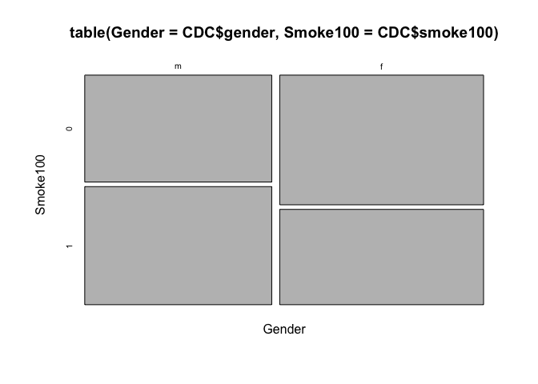

Exercise 3
----------

What does the mosaic plot reveal about smoking habits and gender?

**My Solution**:

A higher proportion of females said that they didn't smoke more than 100 cigarettes in their lifetime.

Subsetting
----------

Interlude (= some commands to inspect data and data structure) and subsetting is something I have already experiences. Therefore I will not go into much detail.

Suppose we want to extract just the data for the men in the sample, or just for those over 30. We can use the R function subset to do that for us. For example, the command

``` r
> mdata <- subset(CDC, CDC$gender == "m")
> mdata1 <- filter(CDC, gender == "m")
```

will create a new data set called mdata that contains only the men from the CDC data set. In addition to finding it in your workspace alongside its dimensions, you can take a peek at the first several rows as usual.

``` r
> head(mdata1, 10)
```

    # A tibble: 10 × 9
         genhlth exerany hlthplan smoke100 height weight wtdesire   age gender
          <fctr>   <dbl>    <dbl>    <dbl>  <dbl>  <int>    <int> <int> <fctr>
    1       good       0        1        0     70    175      175    77      m
    2  very good       1        1        0     71    194      185    31      m
    3  very good       0        1        0     67    170      160    45      m
    4       good       1        1        0     70    180      170    44      m
    5  excellent       1        1        1     69    186      175    46      m
    6       fair       1        1        1     69    168      148    62      m
    7  excellent       1        0        1     66    185      220    21      m
    8  excellent       1        1        1     70    170      170    69      m
    9       fair       1        0        0     69    170      170    23      m
    10      good       1        1        1     73    185      175    79      m

You can use several of these conditions together with `&` and `|`. The `&` is read “and” so that

``` r
> m_and_over30 <- subset(CDC, gender == "m" & age > 30)
> m_and_over30_1 <- filter(CDC, gender == "m" & age > 30)
```

will give you the data for men over the age of 30. The `|` character is read “or” so that

``` r
> m_or_over30 <- subset(CDC, gender == "m" | age > 30)
> m_or_over30_1 <- filter(CDC, gender == "m" & age > 30)
```

will take people who are men or over the age of 30 (why that’s an interesting group is hard to say, but right now the mechanics of this are the important thing). In principle, you may use as many “and” and “or” clauses as you like when forming a subset.

Exercise 4
----------

Create a new object called under23\_and\_smoke that contains all observations of respondents under the age of 23 that have smoked 100 cigarettes in their lifetime. Write the command you used to create the new object as the answer to this exercise.

``` r
> under23_and_smoke <- subset(CDC, age < 23 & smoke100 == 1)
> under23_and_smoke_1 <- filter(CDC, age < 23 & smoke100 == 1)
```

Quantitative data
=================

With our subsetting tools in hand, we’ll now return to the task of the day: making basic summaries of the BRFSS questionnaire. We’ve already looked at categorical data such as smoke and gender so now let’s turn our attention to quantitative data. Two common ways to visualize quantitative data are with box plots and histograms.

Conversion in metric system
---------------------------

To get a better feeling of the data I will add three new rows: `height_cm`, `weight_kg`, \`wtdesire\_kg.

-   1 inch = 2.54 cm
-   1 pound = 0.453592 kg

``` r
> cdc_metric <- CDC %>%
+                 mutate(height_cm = as.integer(round(height * 2.54))) %>%
+                 mutate(weight_kg = as.integer(round(weight * 0.453592))) %>%
+                 mutate(wtdesire_kg = as.integer(round(wtdesire * 0.453592)))
```

Boxplot
-------

We can construct a box plot for a single variable. You can compare the locations of the components of the box by examining the summary statistics.

``` r
> boxplot(cdc_metric$height_cm)
```

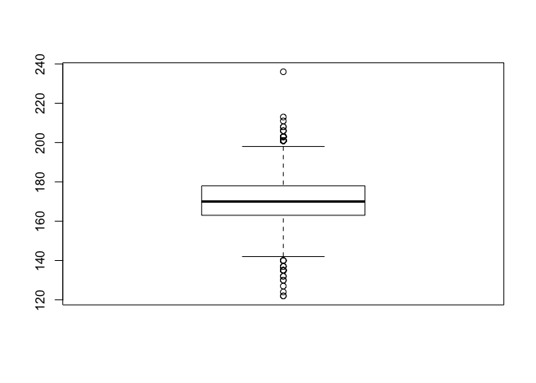

``` r
> summary(cdc_metric$height_cm)
```

       Min. 1st Qu.  Median    Mean 3rd Qu.    Max. 
      122.0   163.0   170.0   170.6   178.0   236.0 

With `ggplot` you need x *and* y, e.g. (at least) *two* variables: see [StackOverflow](http://stackoverflow.com/questions/25049104/why-does-a-boxplot-in-ggplot-requires-axis-x-and-y)). There are two ways to circumvent this problem:

-   Using a special form of `qplot()`, "… a shortcut designed to be familiar if you're used to base `plot()`. … It's great for allowing you to produce plots quickly, but I highly recommend learning ggplot() as it makes it easier to create complex graphics". (From the R Documentation)
-   Providing one variable as an empty string. \[I am not sure of this is an offical way to solve the two-variable-problem, but it works.\]

``` r
> qplot(y = height_cm,
+       x = 1,
+       data = cdc_metric,
+       geom = "boxplot")
```

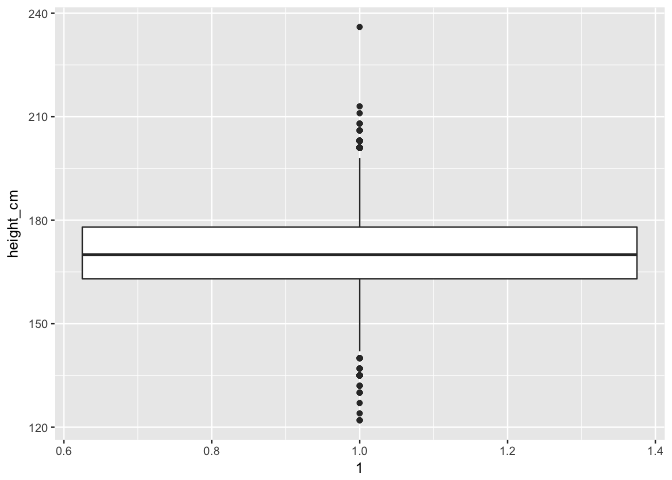

``` r
> ggplot(cdc_metric, aes(x = "", y = height_cm)) + 
+         geom_boxplot()
```

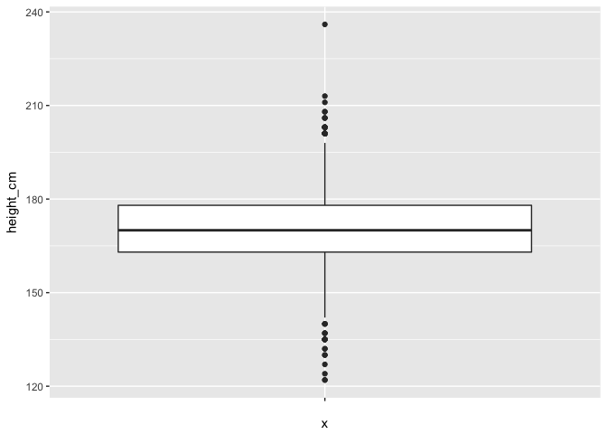

``` r
> summary(cdc_metric$height_cm)
```

       Min. 1st Qu.  Median    Mean 3rd Qu.    Max. 
      122.0   163.0   170.0   170.6   178.0   236.0 

Confirm that the median and upper and lower quartiles reported in the numerical summary match those in the graph. The purpose of a boxplot is to provide a thumbnail sketch of a variable for the purpose of comparing across several categories. So we can, for example, compare the heights of men and women:

``` r
> boxplot(cdc_metric$height_cm ~ cdc_metric$gender)
```

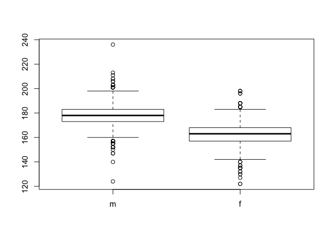

``` r
> summary(subset(cdc_metric, gender == "m", select = height_cm))
```

       height_cm    
     Min.   :124.0  
     1st Qu.:173.0  
     Median :178.0  
     Mean   :178.4  
     3rd Qu.:183.0  
     Max.   :236.0  

``` r
> summary(subset(cdc_metric, gender == "f", select = height_cm))
```

       height_cm    
     Min.   :122.0  
     1st Qu.:157.0  
     Median :163.0  
     Mean   :163.5  
     3rd Qu.:168.0  
     Max.   :198.0  

``` r
> ggplot(cdc_metric, aes(x = gender, y = height_cm)) + 
+         geom_boxplot()
```

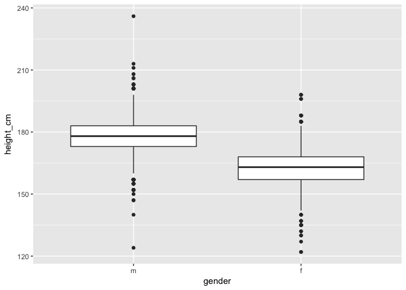

``` r
> summarise(group_by(cdc_metric, gender), 
+           Min. = min(height_cm), 
+           "1st Qu." = quantile(height_cm, probs = 0.25), 
+           Median = median(height_cm), Mean = round(mean(height_cm), digits = 2), 
+           "3rd Qu." = quantile(height_cm, probs = 0.75), 
+           Max = max(height_cm), 
+           IQR = IQR(height_cm)
+           )
```

    # A tibble: 2 × 8
      gender  Min. `1st Qu.` Median  Mean `3rd Qu.`   Max   IQR
      <fctr> <int>     <dbl>  <int> <dbl>     <dbl> <int> <dbl>
    1      m   124       173    178 178.4       183   236    10
    2      f   122       157    163 163.5       168   198    11

`Table`command and mosaicplot
-----------------------------

The `table` command can be used to tabulate any number of variables that you provide.

``` r
> table(cdc_metric$gender,cdc_metric$smoke100)
```

       
           0    1
      m 4547 5022
      f 6012 4419

``` r
> mosaicplot(table(cdc_metric$gender,cdc_metric$smoke100))
```

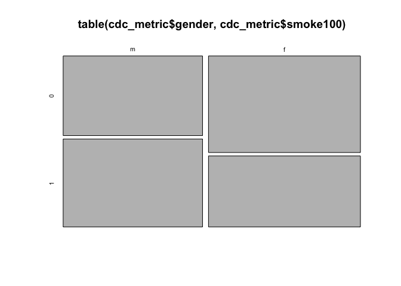

### Question 6 \[partly closed\]: `mosaicplot` in `ggplot`?

What is the equivalent of a `mosaicplot` in `ggplot`? It seems there is no ready to work equivalent, one has to write a function. See the [question and especially the answer on SO](http://stackoverflow.com/questions/19233365/how-to-create-a-marimekko-mosaic-plot-in-ggplot2). There is a more complex [refined version of the function](https://gist.github.com/docsteveharris/4e12c86ac2dd96bfa2dd5cbf13ba3e53), but it appears not so nice to me (even with the color brewer options it looks spartanic. Sure there is also some work on labelling to do with the other version, but it can stand the comparison with the base R version. --- There is also a [related article](http://vita.had.co.nz/papers/prodplots.pdf) by Hadley Wickham, and Heike Hofmann, which I haven't read yet.

``` r
> #' @title Mosaic plot using ggplot.
> #'
> #' @description
> #' Creates a mosaic plot where the dimensions of the cells of a 
> #' confusion matrix represent their marginal proportions.
> #'
> #' @details
> #' Credit for initial iteration to 
> #' [Edwin](http://stackoverflow.com/a/19258045/992999)
> #' This version adds color brewer options and tidies the labelling
> 
> ggMMplot <- function(var1, var2, palette="YlOrRd"){
+   require(ggplot2)
+   
+   levVar1 <- length(levels(var1))
+   levVar2 <- length(levels(var2))
+ 
+   jointTable <- prop.table(table(var1, var2))
+   plotData <- as.data.frame(jointTable)
+   plotData$marginVar1 <- prop.table(table(var1))
+   plotData$marginVar2 <- prop.table(table(var2))
+   plotData$var2Height <- plotData$Freq / plotData$marginVar1
+   plotData$var1Center <-
+           c(0, cumsum(plotData$marginVar1)[1:levVar1 - 1]) +
+           plotData$marginVar1 / 2
+ 
+   # Define label positions on LEFT (y-axis)
+   ylabData <- plotData[plotData$var1 == levels(plotData$var1)[1], ]
+   dd <- (y = c(0, cumsum(ylabData$var2Height)))
+   ylabData$ylabCenter <-
+           sapply(1:(length(dd) - 1), function(x)
+                   dd[x] + (dd[x + 1] - dd[x]) / 2)
+   
+   # Define label positions on the BOTTOM (x-axis)
+   xlabData <- plotData[plotData$var2 == levels(plotData$var2)[1], ]
+   dd <- (x = c(0, cumsum(xlabData$marginVar1)))
+   xlabData$xlabCenter <-
+           sapply(1:(length(dd) - 1), function(x)
+                   dd[x] + (dd[x + 1] - dd[x]) / 2)
+ 
+   ggplot(plotData, aes(var1Center, var2Height)) +
+     geom_bar(stat = "identity", aes(width = marginVar1, fill = var2), col = "White") +
+           scale_fill_brewer(type = "seq",
+                             palette = palette,
+                             guide = FALSE) +
+         # xlabels
+           geom_text(data = xlabData,
+                     aes(
+                     label = as.character(var1),
+                     x = xlabCenter,
+                     y = -0.05
+                     ),
+                     vjust = "inward") +
+         # ylabels
+           geom_text(
+                   data = ylabData,
+                   aes(
+                   label = as.character(var2),
+                   y = ylabCenter,
+                   x = -0.05
+                   ),
+                   vjust = "top",
+                   angle = 90
+                   ) +
+                   xlab("") + scale_x_discrete(labels = NULL) +
+                   ylab("") + scale_y_discrete(labels = NULL) +
+                   theme_minimal() +
+                   theme(plot.margin = margin(rep(20, 4)))
+ }
> 
> ggMMplot1 <- function(var1, var2){
+   require(ggplot2)
+   levVar1 <- length(levels(var1))
+   levVar2 <- length(levels(var2))
+ 
+   jointTable <- prop.table(table(var1, var2))
+   plotData <- as.data.frame(jointTable)
+   plotData$marginVar1 <- prop.table(table(var1))
+   plotData$var2Height <- plotData$Freq / plotData$marginVar1
+   plotData$var1Center <-
+           c(0, cumsum(plotData$marginVar1)[1:levVar1 - 1]) +
+           plotData$marginVar1 / 2
+ 
+   ggplot(plotData, aes(var1Center, var2Height)) +
+     geom_bar(stat = "identity", aes(width = marginVar1, fill = var2), col = "Black") +
+     geom_text(aes(label = as.character(var1), x = var1Center, y = 1.05)) 
+ }
> 
> ggMMplot(cdc_metric$gender,cdc_metric$smoke100)
```

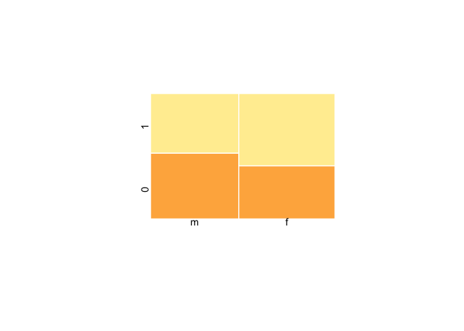

``` r
> ggMMplot1(cdc_metric$gender, cdc_metric$smoke100)
```

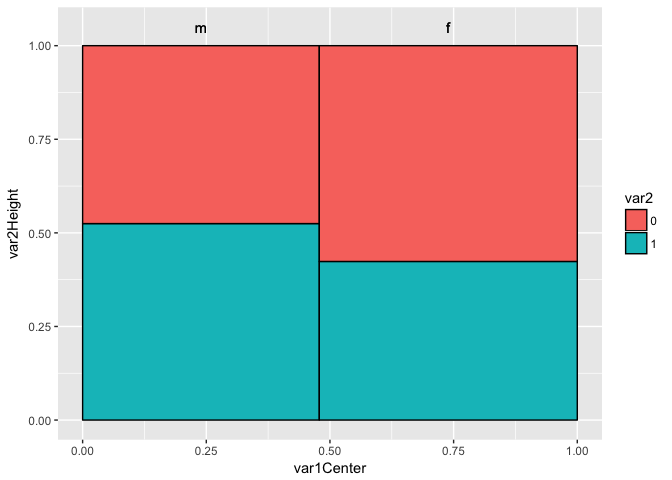

Body Mass Index (BMI)
---------------------

``` r
> bmi <- round((CDC$weight / CDC$height^2) * 703, digits = 2)
> boxplot(bmi ~ CDC$genhlth)
```

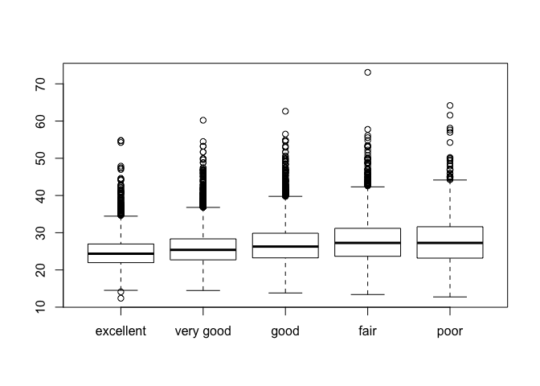 Notice that the first line above is just some arithmetic, but it’s applied to all 20,000 numbers in the CDC data set. That is, for each of the 20,000 participants, we take their weight, divide by their height-squared and then multiply by 703. The result is 20,000 BMI values, one for each respondent. This is one reason why we like R: it lets us perform computations like this using very simple expressions.

### Question 7 \[closed\]: Why is conversation factor 703?

-   2,54 cm = 1 in.
-   0.453592 kg = 1 pound

Conversion factor 703 is the summary of all conversions: weight in pound \* 0.453592 / (height \* 2.54 / 100)^2 = 703.0690061\]

Exercise
--------

What does this box plot show? Pick another categorical variable from the data set and see how it relates to BMI. List the variable you chose, why you might think it would have a relationship to BMI, and indicate what the figure seems to suggest.

**My Solution:**

It shows the relation of BMI for every level of general health as stated by the respondents. One can see that with worse level of general health the BMI is (slightly) higher and the variance is higher (right skewed to the hight end).

``` r
> bmi_metric <- (cdc_metric$weight_kg / (cdc_metric$height_cm / 100) ^ 2)
> boxplot(bmi_metric ~ cdc_metric$exerany)
```


``` r
> p <- ggplot(cdc_metric, aes(factor(cdc_metric$exerany), bmi_metric))
> p + geom_boxplot()
```

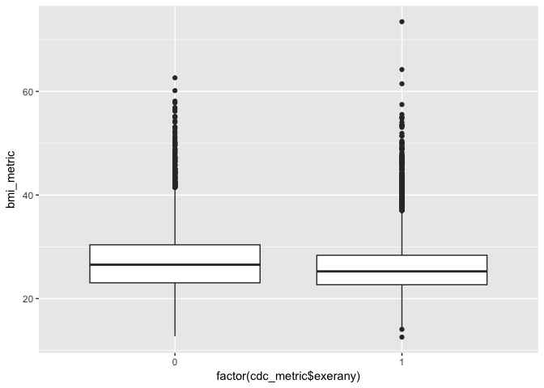 There is a big difference between `boxplot` and `geom_boxplot`: The number variable (double) `exerany` needs to be converted into factor to work with `geom_boxplot`

For respondent with no exercise in the last month the BMI is higher than for people who have done workouts in the last month.

``` r
> bmi_metric <- (cdc_metric$weight_kg / (cdc_metric$height_cm / 100) ^ 2)
> boxplot(bmi_metric ~ cdc_metric$genhlth)
```

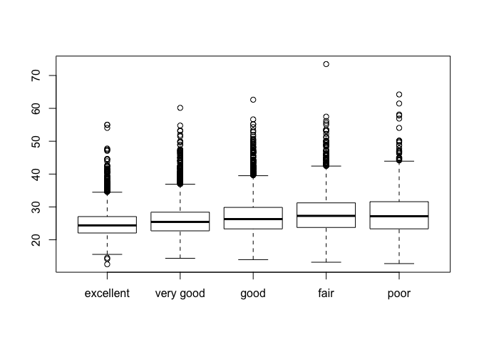

Histograms
----------

Finally, let’s make some histograms.

``` r
> hist(cdc_metric$age)
```

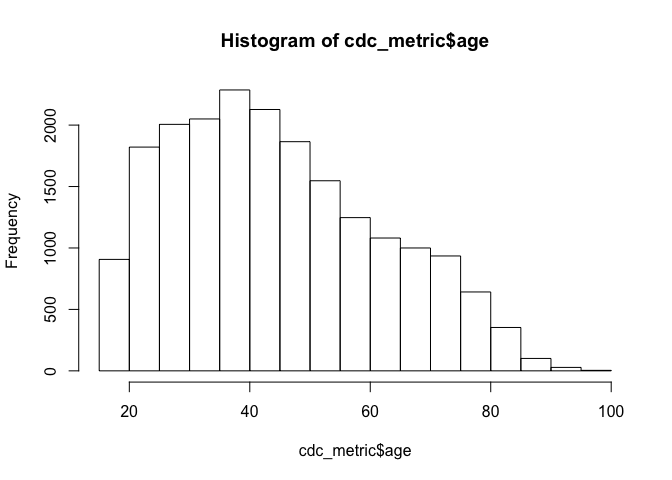

``` r
> hist(bmi)
```

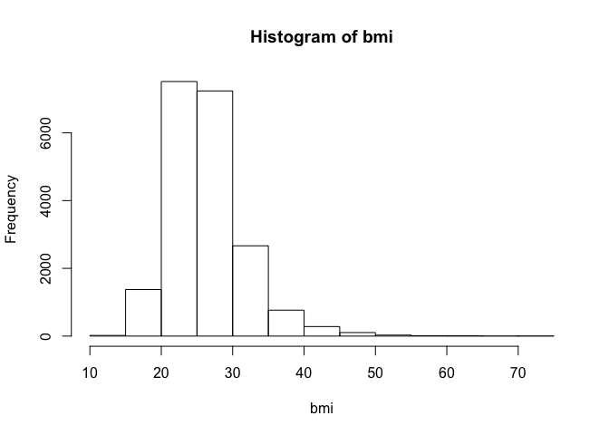

``` r
> hist(bmi, breaks = 50)
```

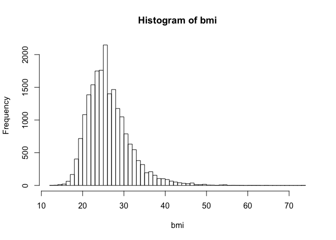

``` r
> p <- ggplot(cdc_metric, aes(bmi_metric))
> p + geom_histogram(bins = 50)
```

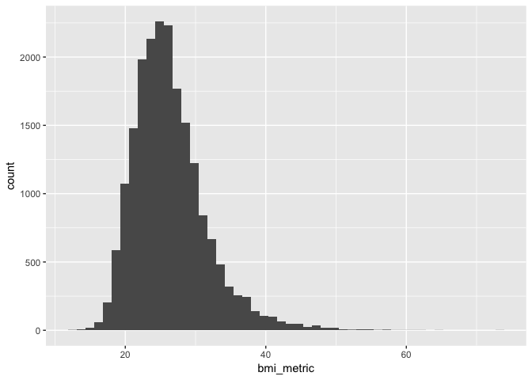

``` r
> p + geom_freqpoly(bins = 50)
```

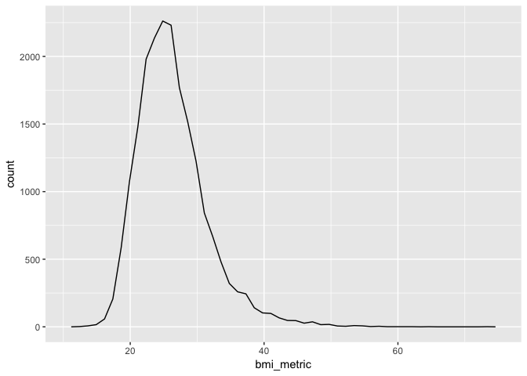

On my own
=========

**Task 1:** Make a scatterplot of weight versus desired weight. Describe the relationship between these two variables.

``` r
> p <- ggplot(data = cdc_metric, mapping = aes(weight_kg, wtdesire_kg), position = "jitter")
> p + geom_point()
```

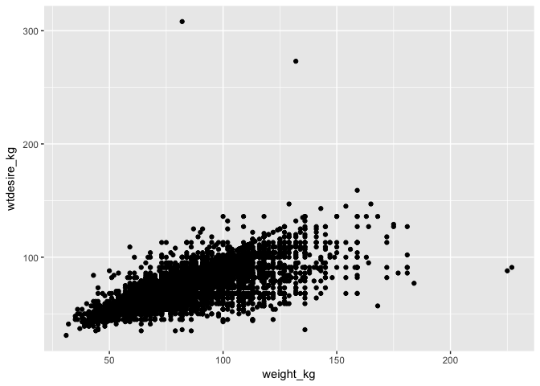

``` r
> cdc_metric %>%
+         select(-height, -weight, -wtdesire) %>%
+         filter(wtdesire_kg > 250)
```

    # A tibble: 2 × 9
        genhlth exerany hlthplan smoke100   age gender height_cm weight_kg
         <fctr>   <dbl>    <dbl>    <dbl> <int> <fctr>     <int>     <int>
    1 very good       1        1        1    56      m       185       132
    2      good       0        1        0    24      m       175        82
    # ... with 1 more variables: wtdesire_kg <int>

**Task 2:** Let’s consider a new variable: the difference between desired weight (wtdesire) and current weight (weight). Create this new variable by subtracting the two columns in the data frame and assigning them to a new object called wdiff.

``` r
> (cdc_metric <- mutate(cdc_metric, wdiff_kg = wtdesire_kg - weight_kg))
```

    # A tibble: 20,000 × 13
         genhlth exerany hlthplan smoke100 height weight wtdesire   age gender
          <fctr>   <dbl>    <dbl>    <dbl>  <dbl>  <int>    <int> <int> <fctr>
    1       good       0        1        0     70    175      175    77      m
    2       good       0        1        1     64    125      115    33      f
    3       good       1        1        1     60    105      105    49      f
    4       good       1        1        0     66    132      124    42      f
    5  very good       0        1        0     61    150      130    55      f
    6  very good       1        1        0     64    114      114    55      f
    7  very good       1        1        0     71    194      185    31      m
    8  very good       0        1        0     67    170      160    45      m
    9       good       0        1        1     65    150      130    27      f
    10      good       1        1        0     70    180      170    44      m
    # ... with 19,990 more rows, and 4 more variables: height_cm <int>,
    #   weight_kg <int>, wtdesire_kg <int>, wdiff_kg <int>

``` r
> summary(cdc_metric$wdiff_kg)
```

        Min.  1st Qu.   Median     Mean  3rd Qu.     Max. 
    -137.000  -10.000   -4.000   -6.611    0.000  226.000 

``` r
> ggplot(cdc_metric, mapping = aes(wdiff_kg)) +
+         geom_freqpoly(bins = 150)
```

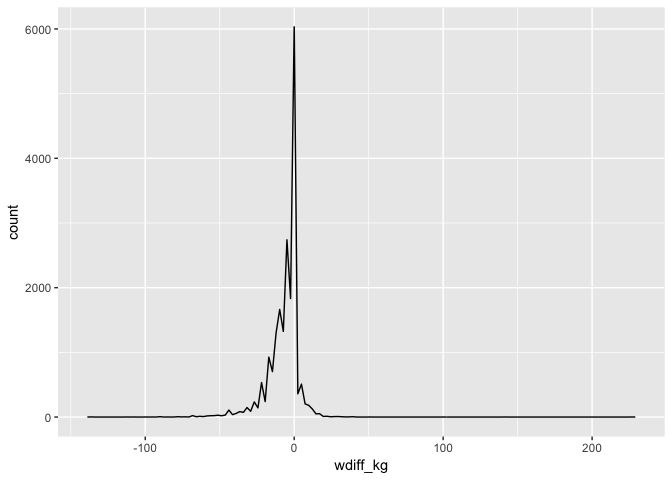

**Task 3:** What type of data is wdiff? If an observation wdiff is 0, what does this mean about the person’s weight and desired weight. What if wdiff is positive or negative?

-   wdiff is integer
-   if wdiff is 0 then the person has its ideal weight
-   a negative wdiff means that the person wants to have less weight, a positive wdiff they want to have more weight.

**Task 4:** Describe the distribution of wdiff in terms of its center, shape, and spread, including any plots you use. What does this tell us about how people feel about their current weight?

``` r
> ggplot(cdc_metric, mapping = aes(wdiff_kg)) +
+         geom_histogram(bins = 20)
```

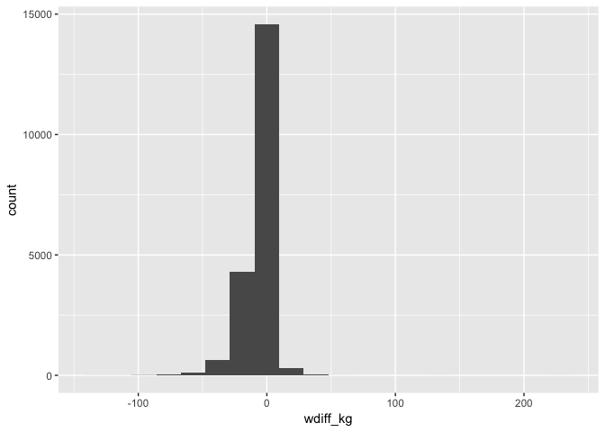

``` r
> ggplot(cdc_metric, mapping = aes(wdiff_kg)) +
+         geom_histogram(bins = 20) +
+         scale_x_continuous(name = "Weight real - Weight desired", limits = c(-50, 50)) +
+         scale_y_continuous(name = "Frequency", limits = c(0, 10000))
```

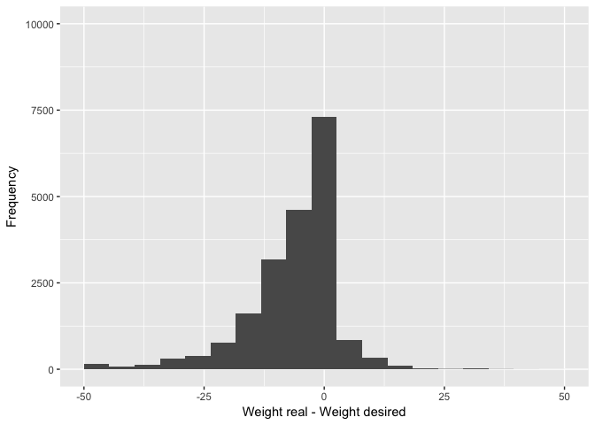

``` r
> summary(cdc_metric$wdiff_kg)
```

        Min.  1st Qu.   Median     Mean  3rd Qu.     Max. 
    -137.000  -10.000   -4.000   -6.611    0.000  226.000 

### Question 8 \[solved\]: How to enlarge the x-axis?

How to provide a better graph, where the x-axis is centered between -10 and + 10? I could find a solution at "Statistical tools for high-throughput data analysis" the [STHDA website](http://www.sthda.com/english/wiki/ggplot2-axis-scales-and-transformations#change-x-and-y-axis-limits). – The warning `Removed 146 rows containing non-finite values (stat_bin)` says that some data falls outside the provided limit.

The plot shows that many people desire to have a little less weight (4-6 kg) as they have. It is a unimodal distribution There is one peak around 0 (real weight is desired weight) but there are also some strange value: A person who wants 137 kg less weight, but also another person who wants 226 kg more weight!

**Task 5:** Using numerical summaries and a side-by-side box plot, determine if men tend to view their weight differently than women.

``` r
> ggplot(cdc_metric, mapping = aes(factor(gender), wdiff_kg)) +
+         geom_boxplot() +
+         labs(title = "View of own weight by gender") + 
+         labs(x = "Gender") +
+         scale_y_continuous(name = "Weight real - weight desires", limits = c(-100.0, 100.0))
```

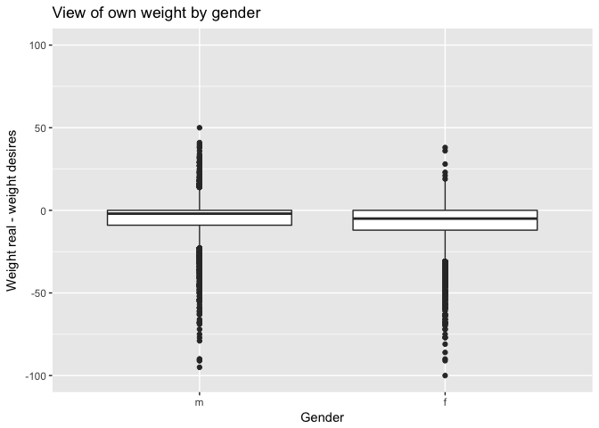 Women tend to desire a bigger reduction of weight as men.

**Task 6:** Now it’s time to get creative. Find the mean and standard deviation of weight and determine what proportion of the weights are within one standard deviation of the mean.

``` r
> (round(SD1 <- mean(cdc_metric$weight_kg) - sd(cdc_metric$weight_kg)))
```

    [1] 59

``` r
> (round(SD2 <- mean(cdc_metric$weight_kg) + sd(cdc_metric$weight_kg)))
```

    [1] 95

``` r
> nrow(filter(cdc_metric, weight_kg >= 59 & weight_kg <= 95)) / nrow(cdc_metric) 
```

    [1] 0.731

73% of the weights are within one standard deviation of the mean.
